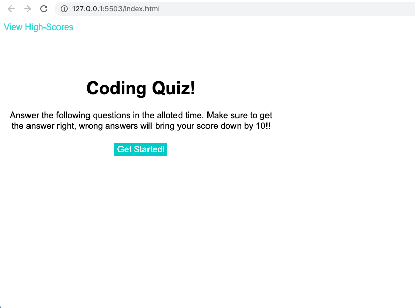

# code-quiz-challenge

This challenge is to test people on their coding knowledge. It scores you based on the amount of time you take to complete the quiz and the amount of correct answers you get. This quiz has a high score page that will store the scores and has fun sound effects whe you answer the questions. 

You can can try the quiz at the following site: https://caroline1418.github.io/code-quiz-challenge/

